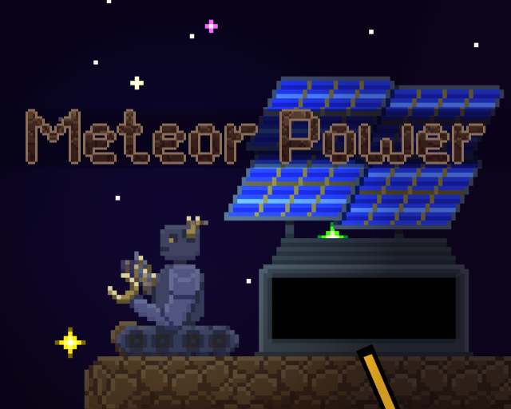
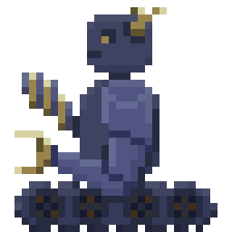

# Meteor Power

  

> _**[Play the game!](https://levi.dev/ludum-dare-50)**_

> A point-and-click AI platformer.

> Build solar stations, connect power lines, and collect more energy before you run out and overwhelmed by meteors!

## 👨‍💻 The jam

Ludum Dare is a semi-annual event where people create a game over the weekend. Ludum Dare is a ranked competition, with a clever voting system that gets more eyes on your game when you in turn rate other games. There are two tracks you can participate in:

-   In the "**Compo**" track, you must create all your own art, music, sounds, etc. from scratch, work by yourself, and finish within 48 hours.
-   In the "**Jam**" track, you can work with a team, you can use art, code, music, sounds, etc. that already existed or was created by someone else, and you get 72 hours to finish.

Additionally, the games all follow some central theme, which is only announced at the start of the jam.

I worked solo and created everything during the event. Except of course for my Scaffolder and Surfacer frameworks (which is fine, you're allowed to use pre-existing code).

### 💡 The theme

"Delay the inevitable"

## 🎮 Controls

-   Mouse and keyboard.
-   A/S/D/Q/W/E to select a bot.
-   Left-click on a platform to move the bot.
-   Left-click a station button to do that command.
-   Right-click to cancel a command.

## 💿 Software used

-   **[Godot](https://godotengine.org/):** Game engine.
-   **[Piskel](https://www.piskelapp.com/user/5663844106502144):** Pixel-art image editor.
-   **[Aseprite](https://www.aseprite.org/):** Pixel-art image editor.
-   **[Bfxr](https://www.bfxr.net/):** Sound effects editor.
-   **[DefleMask](https://deflemask.com/):** Chiptune music tracker.
-   **[Surfacer](https://godotengine.org/asset-library/asset/968):** Framework for procedural path-finding across 2D platforms.
-   **[Scaffolder](https://godotengine.org/asset-library/asset/969):** Framework for general app and UI infrastructure.
-   **[SurfaceTiler](https://github.com/SnoringCatGames/surface_tiler):** Framework for "next-level" autotiling.

## ⚙️ Getting set up

> **NOTE:** This repo uses [Git submodules](https://git-scm.com/book/en/v2/Git-Tools-Submodules) to include frameworks.

To learn more about how the code works, checkout the [Surfacer](https://github.com/SnoringCatGames/surfacer/) and [Scaffolder](https://github.com/SnoringCatGames/scaffolder/) READMEs.

## 📃 Licenses

-   All code is published under the [MIT license](LICENSE).
-   All art assets (files under `assets/images/`, `assets/music/`, and `assets/sounds/`) are published under the [CC0 1.0 Universal license](https://creativecommons.org/publicdomain/zero/1.0/deed.en).
-   This project depends on various pieces of third-party code that are licensed separately. Here are lists of these third-party licenses:
    -   [addons/scaffolder/src/config/scaffolder_third_party_licenses.gd](https://github.com/SnoringCatGames/scaffolder/blob/master/src/config/scaffolder_third_party_licenses.gd)
    -   [addons/surfacer/src/config/surfacer_third_party_licenses.gd](https://github.com/SnoringCatGames/surfacer/blob/master/src/config/surfacer_third_party_licenses.gd)
    -   [src/config/third_party_licenses.gd](./src/config/third_party_licenses.gd)

## I livestreamed the development on Twitch!

https://www.twitch.tv/ukulelefury

  

